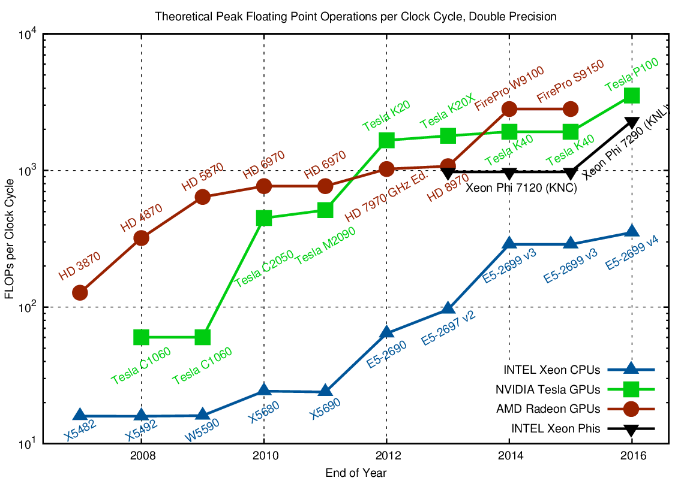
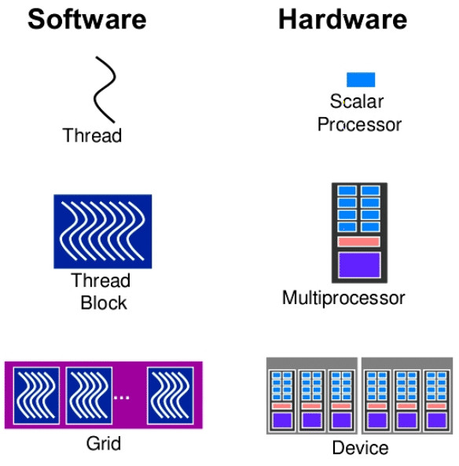

# CPU vs. GPU

GPU stands for Graphics Processing Unit. Originally they were designed and used (as the name implies) solely for image processing. The development of the graphic cards was driven by the gaming industry and in the early nineties they became efficient enough for solving a class of traditional HPC problems as well,  if properly formulated.  Since then more HPC features (e.g. double precision arithmetic) have been added to GPUs and thus the term GPGPU (General Purpose Graphics Processing Unit) was coined. Today only the term GPU is used in HPC. 

When comparing the CPU to GPU one word can describe the differences: **complexity**. Below is shown a schematic representation CPU and GPU side by side.  

The CPU is a more complex, "smarter" device oriented toward general purpose usage. It fast and versatile, designed to run operating systems and various very different applications requiring interactivity, all in a serial way.  It has a large part of the transistors dedicated to branch prediction and control,  and another large part to cache for prefetching data from the memory. Compared to CPU, in the GPU the fraction of transistors dedicated to the mathematical operations is much higher. The GPU has a very small amount of transistors dedicated to control and caching. GPUs were strictly designed to create images for computer graphics and video game consoles, and they are better are at performing repetitive and highly parallel computing.  On a GPU thousands of small threads can be created, each one performing very few, but identical mathematical operations. This is called SIMD or Single Instruction Multiple Data computing. GPUs are more energy efficient, that is, they use less energy per floating point and other arithmetic operations than CPUs. For this reason most of the new systems targeting exascale level of performance utilize GPUs. Otherwise, the electricity bills of running these systems would become prohibitive.

Due to their specialized nature GPUs need CPUs on their side in the supercomputer nodes. CPUs are often called *hosts* and GPUs *devices*. A node may consist of two CPUs and four GPUs with fast interconnect in between. The top-level program execution takes place in CPUs and computing intensive parts (often called *kernels*) are *off-loaded* to GPUs. Accordingly, GPUs are often referred to as accelerators.

However, this hierarchical design has a drawback: moving data between the CPU and GPU in a node is relatively slow and is a typical performance bottleneck. The programmer must pay careful attention to minimizing data transfers between the host and device. In addition to this, the relative simplicity of GPUs comes with a cost: the programming is more involving and extracting good performance can sometimes be difficult and depends on the nature of the problem. When writing a CUDA program the programmer has to take into account the particular hardware structure of the GPUs. 

As seen in the figures 1 and 3, the GPU devices are comprised from several units called symmetric multiprocessor (SM), the GPU main RAM memory, and a thread scheduler. Each SM is comprised of several light computing cores, each one capable of running onely 1 light thread. 

When a task is scheduled to be executed on GPU it is divided in many parts, each one very small executed in one thread. For example rendering an image on the screen would create create for each frame 1 thread which would compute the 4 values needed for a pixel (RGB and the intensity). These threads are much lighter than CPU threads and there is very little cost associated with their creation.  For each task  the threads are grouped in blocks which are each assigned to an SM. One SM can have more than one block running at a time, but a block can not be splitting between various SM.

As mentioned before the high performance of the GPUs comes from parallelism and simplicity of the  cores. The control part is much smaller, not so versatile as the control in the CPUs.  As a result threads are executed in groups of 32 called warps, each thread in the warp executing the same instruction. This execution mode is called SIMT, single instruction multiple threads. We note that SIMT  also implies SIMD, becuase each instruction will be executed in by separate threads on separate parts of the data. 
While the many computing cores in the GPUs can perform lots of calculationsin parallel, the programmer also has to make sure that the access to memory is efficient. GPUs provide very large bandwidth to access data in the GPU memory, however the read/write accessing must be done in a specific way to achieve good performance. Two "adjacent" threads should allways access adjacent memory locations, i.e. **coalesced** access. 

In addition to the main memory which is accessible by all threads workin in a task, the GPUs other types of memory which can be use to further accelerate the application: 

Each SM contains *shared memory* which can be access by threads in a specfic block. It is very fast and it can. be used as a proigrammable cache to reduce the repeated accesses to the same data. For example in the case of long range molecular dynamics, each thread in a block would load some data into the *shared memory*, and the other threads would  be able to access this data and reuse it to compute more interactions. In this particular case without the shared memory we would have to read from the main GPU memory a number of times equal to the number of threads in the block. In addition to the shared memory we have registers which contain variables local to each thread. The registers are very fast to access, but the amount available per individual thread is limited. The programmer does not have access direct to registers, but it can optimize the code to reduce the number when it is needed. Other types of memory are available in th GPUs with special access patterns such as contant memory, which is never changed from the device or th texture memory. The texture memory resides in the main memory, hwoever it has a special accessing patter and it is chached on the SM in a manner which reflects the locality of the data. 
TODO: GPU programming models: CUDA, Hip etc.

GPUs are especially efficient in machine learning applications, more precisely in training neural networks.

Nvidia has traditionally been the most visible GPU vendor but for example AMD is again investing heavily into GPUs. The LUMI supercomputer is built using AMD GPUs. 
