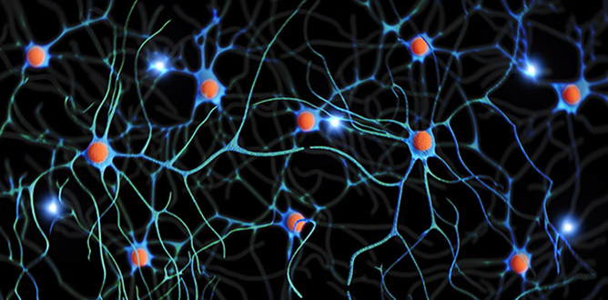

# What are supercomputers used for ?
HPC has been a critical part of academic research and innovation for a long time. "In-silica" experiments can reduce and in some cases  eliminate the need for physical tests. In the same time results are obtained much faster.  This reduces costs and drives innovation. Below are some examples in which HPC plays an important role.

### Materials Science
* new materials
* design of meta-materials
* industrial processes

### Engineering & Industry
* oil and gas: finding new reservoirs, fluid flow and seismic processing
* aerospace: flow of air over the wings
* financial technology: risk analysises, high-frquency trading, financial modeling, fraud detection
* cybersecurity
* constuction

### Life Sciences
* genomics, bioinformatics: analysing drug interactionssequencing DNA, predicting protein folding
* healthcare: medical imaging and diagnozing, researching drugs and vaccines, living heart project, cancer treatment

### Earth Sciences 
* long term climate modeling
* weather prediction

### Machine learning
* deep learning
* analysis of data from high throuput experiments
* prediction of material properties
* retail (targeted product recommendations)

## Media and etertainment
* creating animations, sepcial effects for movies, transcoding media files

