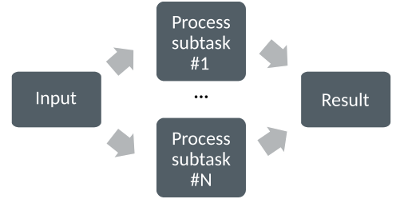

<!-- Title: How to compute in parallel? -->

<!-- Short description:

In this article we briefly introduce the basic idea of parallel computing and
demonstrate it with a simple example.

-->

# Computing in parallel

The underlying idea of parallel computing is to split a computational problem
into smaller subproblems. Multiple of these subproblems can then be solved
*simultaneously* by multiple processing units. In modern CPUs, the single
execution unit is typically a CPU core.

How a problem is split into smaller subtasks depends fully on the problem.
There exists various paradigms and programming approaches on how to do this
and in the [next step](concepts.md) we will discuss some of them in more
detail.

# Example: How to compute a sum in parallel?

Let us assume that Alice and Bob want to compute the sum of 20 numbers (say
the prices of their grocery shopping). Either Alice or Bob could do it alone,
just like a single CPU core could compute it *in serial*. But how could they
do it *in parallel*?

In order to compute the sum in parallel (and hopefully faster!), Alice and Bob
could divide the numbers in two and then each compute the sum of their own
half. After Alice and Bob have computed these partial sums, all they need
to do is to add them up to have the total sum of all the numbers.

FIXME: missing figure
