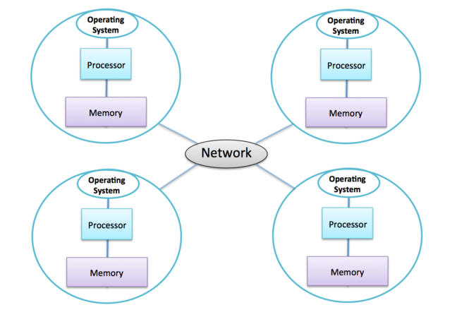

<!-- Text and picture from Supercomputing course by EPCC -->

# Distributed memory architecture

Because of the difficulty of having very large numbers of CPU-cores in
a single shared-memory computer, all of today's supercomputers use the
same basic approach to build a very large system: take lots of
separate computers and connect them together with a fast network.

For the moment, let's ignore the complication that each computer is
itself a shared-memory computer, and just say we have one processor in
each computer: 

The most important points are:     

+  every separate computer is usually called a _**node**_

+ each node has its own memory, totally separate from all the other nodes

+ each node runs a separate copy of the operating system

+ the only way that two nodes can interact with each other is by
  communication over the network. 

The office analogy is very useful here: a distributed-memory parallel
computer is like workers all in separate offices, each with their own
personal whiteboard, who can only communicate by phoning each other. 

| Advantages  | Disadvantages |
| -------------| ------------|
|  the number of whiteboards (i.e. the total memory) grows as we add more offices   |if we have large amounts of data, we have to decide how to split it up across all the different offices   |
| there is no overcrowding so every worker has easy access to a whiteboard     | we need to have lots of separate copies of the operating system   |
| we can, in principle, add as many workers as we want provided the telephone network can cope. | it is more difficult to communicate with each other as you cannot see each others whiteboards so you have to make a phone call    |

The second disadvantage can be a pain when we do software updates - we
have to upgrade thousands of copies of the OS! However, it doesn't
have any direct cost implications as almost all supercomputers use
some version of the Linux OS which is free. 

It turns out that it is much easier to build networks that can connect
large numbers of computers together than it is to have large numbers
of CPU-cores in a single shared-memory computer. This means it is
relatively straightforward to build very large supercomputers - it is
an engineering challenge, but a challenge that the computer engineers
seem to be very good at tackling! 

So, if building a large distributed-memory supercomputer is relatively
straightforward then we've cracked the problem?  

Well, unfortunately not. The compromises we have had to make (many
separate computers each with their own private memory) mean that the
difficulties are now transferred to the software side. Having built a
supercomputer, we now have to write a program that can take advantage
of all those thousands of CPU-cores and this can be quite challenging
in the distributed-memory model. 

<!-- Why do you think the distributed memory architecture is common in -->
<!-- supercomputing but is not used in your laptop? **Share your
thoughts in the comments section.** -->
