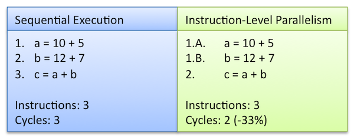
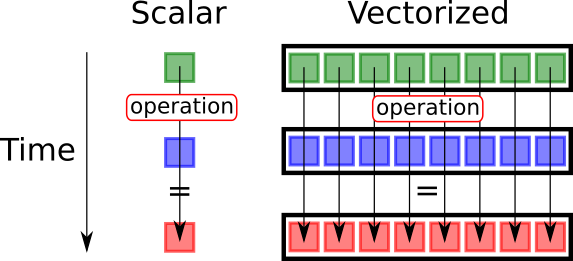
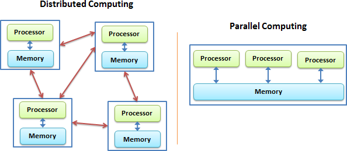

# Types of parallelism

When the hardware and the compiler support them, different types of parallelism can be employed to speed up the calculations. 

* **Bit-level parallelism**: refers to the parallelism based on increasing the _processor word_ size. For example in the case of a 8-bit processor trying to add 2 16-bit variables would have to divide the operation in two instructions. In the first instruction it would add the 8 lower bits and then in the second one the higher 8 bits. On a 16-bit processor this would be completed using a single instruction. Note that doing operations with 8-bit variables (less precision on the 16-bit processor  will take the same amount of time as using 16-bit variables. 
Now all processors use 64 bit words. The programmers have no control at this level, but have to take this into account and choose the appropriate bit size for the varoables in order to achieve the highest possible performance at the precision required by the specific application. 
        * Instruction pipelining
        * Out-of-order execution 
        * Register renaming 
        * Speculative execution 
        * Branch prediction 
* **Instruction-level parallelism (ILP)**: refers to executing simultaneous multiple instructions. For example if the program has to perform sequentially two additions which are independent from each other they can be executed in parallel (see image below). The programmer does not have direct access to the this parallelization, the compiler does the parallelization, however the programmer needs to arrange the code to "help" the compiler detect the parallelizable parts.

<!--- [](https://i.pinimg.com/originals/1f/a4/d7/1fa4d7bda58e84045b9456c391d2aa58.png) --->
Depending on the architectures and compilers, the operations targeted for ILP do not need to be identical. At hardaware level, processors which can perform ILP have to support features such as 
* **Vectorization**: refers to parallelism similar to the ILP, in which a specific instruction is applied to multiple data simultaneously. This allows for more efficient parallelization of the code than the ILP. Similarly to the ILP, the programmer has little control over the parallization, however he or she can indicate specific loops to be targeted by the compiler. 
For example, if a programm needs to perform the addition of two vectors element by element we would use a `for` loop in which an addition is performed for each value of `i=0, ...,N-1`:
```C
for(int i=0; i<N; i++)
    c[i]=a[i]+b[i];
```
In the scalar mode the  execution is serial, i.e. first is computed the addition `c[0]=a[0]+b[0]` corresponding to `i=0`, then the addition corresponding to `i=1` and so on, up to `i=N-1`. In the vectorized mode the processor will execute several additions in thee same time. 



Given a loop, the vectorization is done automatically by the compiler. In the cases where there is true data dependency shorter than the vector lenght, the programmer can "help" the compiler, by splitting the main loop. For example the _loop_ shown above would be changed into:
```C
for(int i=0; i<N; i+=k)
    for(int j=0; j<k; j++)
        c[i+j]=a[i+j]+b[i+j];
```
I this case the outer loop will be executed sequentially (starting with `i=0` and then increamenting by `k` up to `N`), but the inner loop in this case will vectorized by executing simultaneously all the operations corresponding to each value of `j`.  The size of the vectorization, `k`, depends on the machine and the type of variables, but for small values you can get a `k` times decrease in the execution time. For integers and single precision variables `k=8`. There are different set of vectorization instructions that the modern processors support: MMX, SSE, and AVX. These set of instructions implement _single instruction, multiple data_  (SIMD) features into **x86** processors (Intel and AMD). 
* **Core level parallelism**: the same calculation or different calculation is performed to the same data or to different data by a number of cores. The calculations are performed concurrently and often cooperatively. 
All modern processors are multi-cores. In supercomputers we usually have more than one multi-core processor installed in the same node and sharing the same memory and local disks, and in many cases accelerators. Furthermore, we have thousandas of nodes linked together by extremely high speed network. In case  we can emply include many types of parallel programming models:  multi-threaded with shared memory, multi-process with distributed memory, hybrid,  and as well task parallelism in which each diffferent task runs independently of the others.
The programmer can take advantage of the multi-core and multi-processors architectures using using specalized APIs. **OpenMP** (Open Multi-Processing) is the de facto standard for multithreaded parallelizations, while for multi-process parallelization  **MPI** (Message Passing Interface) is the most used.

