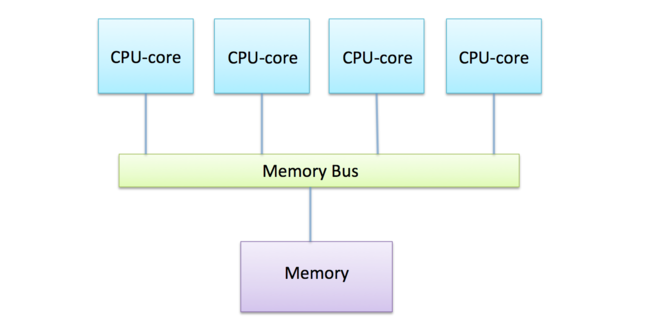

Parallel computing is a type of computing in which the task is divided in several sub-tasks, which are independent of each other and can be executed simultaneously. Most of the computing problems are not trivially parallelizable, which means that the sub-tasks need to have access from time to time to some of the results computed by other sub-tasks. The way the sub-tasks exchange the needed information depends on the available hardware. 

# Shared Memory 

The shared memory refers to physical memory device which can be access by more than on computing core.

Examples of shared memory are the CPU cache which is shared by all cores in the same CPU and computer main memory which is shared my all the cores on the same motherboard. (In the case of GPU the shared memory term is used to refer to the local memory available on each SM, the threads in a block can access and shared data with each other via the mentioned.) Personal computers and mobile phones are all based on shared memory architectures. The connection between the various cores and memory is done via a **memory** *bus* that takes all the requests from each core and fetches or writes the data to the memory. 

Programmatically the shared memory is seen as a space in the memory allocated to a program which can be access by a group of threads working together, without additional communication. All threads in a group can write and read from a given location in memory.  A good analogy to the shared memory programming model is an office where several workers work together to solve a problem. Taking further this analogy the coomunications between workers is done via a whiteboard which can be read or written only by going near it. From this anaolgy we can already see advantages and limitations to this kind of approach.

### Advantages
There are several advantages of using shared memory:
* good performance: the workers do the work and put the results on the whiteboard which is close to all of them. Because all data is global, there is no time lost in communications between different threads.
* simple programming model: the shared memory programming is supported by all high level programming languages and the codes can be used without changes on different multi-core processors.

### Limitations
There are also limitations to using shared memory architectures. 
* memory capacity: only a few workers can fit in the office. The size of the problem to be solved is limited by the available memory. If the problem is too big for the device, the only solution is to change to another device which has more memory. Developing devices with larger capcity is very costly. 
* memory access speed: there is a limitation to how many workers can read and write the white board. It is easy to fill up the **memory** *bus* which results in the computing cores waiting and  not being utilized at maximum. In some application it can be faster to use  only some of the all available cores.
* race conditions and locks: the memory can be access by all threads at anytime, which means that the programmer has to make sure that the data is written by a specific thread before it is used by another thread. The scynchronizatio needed to avoid the race conditions can result in deadlocks.

