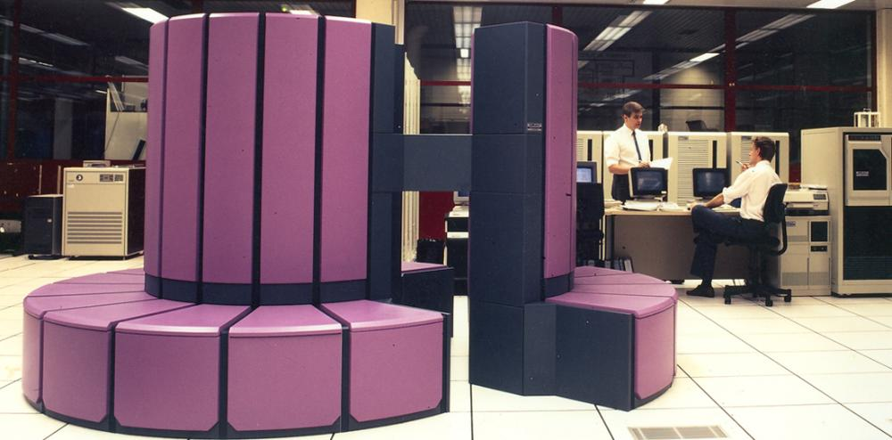

## A brief history of supercomputing

The history of machine computing started with mechanical computers which used gears, levers, curved plates etc. to perform calculations. The mechanical computers were typically single-purpose machines and could not be programmed in the modern sense. In addition to the standard desk calculators, typical examples were the devices used in aiming bombs, guns and torpedoes during World War II. However, programmable motor-driven mechanical machines such as Z1 were also developed.

The mechanical computers were succeeded by electro-mechanical machines which used switches and relays to implement logic.

ENIAC (Electronic Numerical Integrator and Computer), which became operational in 1945, was the first fully electronic programmable general-purpose computer and can
be considered the first supercomputer. Originally constructed for calculating artillery shell and missile trajectories, it was located at the University of Pennsylvania and contributed to the US thermonuclear weapons development.

ENIAC relied on vacuum tubes, and its performance (about 400 flops or floating point operations per second) was in the order of one thousand times greater than the preceding electro-mechanical computers. ENIAC was a decimal (as opposed to modern binary) computer and was programmed by changing the configuration of the system by turning dials and plugging cables to receptables.

ENIAC and its vacuum-tubed successors were followed by transistorized systems in the latter half of the 1950's. IBM's 7090 mainframe (first installation in 1959) was specifically designed for solving large-scale scientific and engineering problems.

The term *supercomputing* was first used in 1964 when Control Data Corporation introduced the CDC 6600 system designed by Seymour Cray, whose name went on to became synonymous with supercomputers. An improved version, called CDC 6700, was introduced in 1969. Cray subsequently left Control Data Corporation, founded a company of his own, and in 1976 debuted the iconic Cray-1 supercomputer.

In addition to Cray (now a product line of HPE), the most common names of the supercomputer vendors include IBM, SGI/Silicon Graphics, Hewlett-Packard, Atos, Dell, Intel, Fujitsu, Lenovo and Sun.

Nowadays, a supercomputer is often defined as a computer that has much larger
computing power than a typical desktop computer. As computers constantly become more powerful, this is a moving defintion. As an example, a
modern laptop is 1000 times more powerful than the biggest
supercomputer in the Nordic countries thirty years ago. 

## Supercomputing in Finland and at CSC

CSC's (Center for Scientific Computing) history can be traced back to 1971 when a special office was founded to operate a Univac 1108 system. There have since been a number of changes to the name, the organization and the owner of the entity that was tasked with operating the Finnish high-performance computing resources for scientists. In the 1990's, the name CSC was introduced, and the Ministry of Education and Culture became the sole owner of the company. Today, universities and polytechnics own a minor share of CSC – IT Center for Science Ltd.

CSC and its predecessors have operated the following major systems in Finland:

- **Univac 1108 1971–1982**
- **Univac 1100/61 1982–1985**
- **VAX 8600 1985**
- **Cray X-MP 1989**
The 'purple top-hat'. Vector processor.
- **Cray C94 1995**
The last vector processor machine at CSC.
- **Cray T3E 1996–2002**
The first MPP (massively parallel processor) system in Finland. 540 375 MHz DEC Alpha EV56 processors, 128 MB memory per node. 3D torus interconnect. Liquid-cooled. Theoretical peak performance 405 Gflop/s.
- **IBM p690 2002–2005**
16 loosely connected islands with 32 1,1 GHz Power4 processors. 512 processors in total, 32–64 GB memory per processor. Theoretical peak performance 2253 Gflop/s.
- **Cray XT4/XT5 2007–2012**
MPP system with dual 2,3 GHz AMD Opteron quad core processors and 8 GB memory per node. 10864 cores in total. 3D torus interconnect. Air-cooled. Theoretical peak performance 102 Tflop/s. Power 520 kW.
- **Cray XC40 2012–2019**
MPP system with dual 2,6 GHz Intel Xeon 12 core processors and 64 GB memory per node. 40512 cores in total. 3D torus interconnect. Liquid-cooled. Theoretical peak performance 1690 Tflop/s. Power 680 kW.
- **Bull XH2000 2020 2020–**
MPP system with dual 2,6 GHz AMD Rome 128 core processors and 256 GB memory per node. 169728 cores in total. Dragonfly+ interconnect. Liquid-cooled. Theoretical peak performance 7061 Tflop/s. Power 1070 kW.
    
 There have also been a number of supporting systems.
 
 
 
CSC's computing capacity and the Top500 list rankings of selected systems in 1993–2020. The performance is normalized and presented on a logarithmic scale. Hence, the growth is exponential rather than linear.
