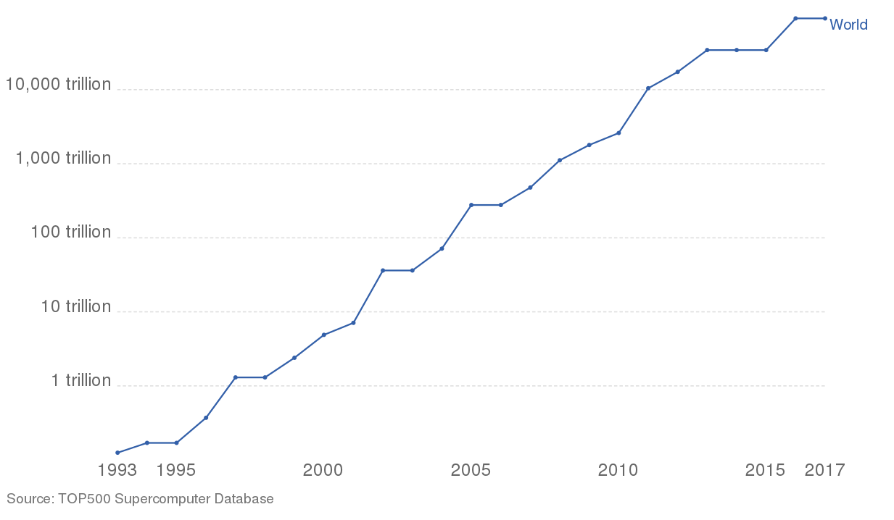

## Supercomputer Performance

* To understand how powerful a Supercomputer is and compare it with other ones, there are few metrics. The oldest and most classic one is the floating operations per second (FLOPs). This measures the performance of a processor and not only.

* What is a FLOPs? If we do the calculation for example, 2.1 + 4.3  in one second, then this is one floating-point operation per second, which means 1 FLOPs, it is a calculation between real numbers.

* When a computer can execute 1 billion FLOPs, then we can say it is 1 GigaFlops (GFLOPs). Similarly, we call 1 TeraFlops (TFlops) for one trillion (10^12) FLOPs, and 1 PetaFlops (PFLOPs) when a supercomputer can execute 1 quadrillion or 10^15 FLOPs.

### TOP500

* What is a benchmark: An application that its sole purpose to measure a functionality of the supercomputer how well it performs. 

* The Linpack benchmark measures a system's floating point computing power. It measures how fast a computer does matrix operations to solve an equation. Supercomputers have a theoretical peak performance with regards to their hardware, but HPL calculates the performance that is lower than the peak, as the theoretical one is based on a perfect benchmark and system.

* TOP500: Is the official list where each organization that owns a supercomputer can execute the HPL and submit their results. This list is released twice every year and it recognizes which Supercomputers are the most powerful and it includes the 500 most powerful supercomputers.

* In the first TOP500 list, June 1993, the first Supercomputer achieved 59.7 GFlops and it was from USA. Nowadays, during the list of June 2020, the first Supercomputer achieved 415530000.0 GFlops and it is located in Japan, which means that in 27 years, the power of the number one supercomputer was increased 6960301 times. Regarding the last systems of the list, on June 1993 it had a power of 0.4 GFlops while on June 2020 is 1228000 GFlops.We can observe the significant increase of the Spercomputer power all these years.

*FLOPs from the top systems in TOP500 list from 1993 until 2017*

* To compare and understand better, the Macbook pro 13" 2020 model, has a performance of around 311 GFlops which means that it would be number one supercomputer on June 1993 but for 2020, the number one supercomputer has the power of around 1.3 millions Macbook pro 13".

* The Mahti supercomputer at CSC - IT For Science Ltd. has power of 7.5 PFlops, which means it can execute 7.5*10^15 operations per second or around 24000 Macbook pro 13" combined. If all the population of the earth does one operation per second, then the performance would be 1 million times less than Mahti.  

* LUMI supercomputer will have a theoretical peak performance of XXX PFlops and we expect that it would be in top 10 supercomputers of the world in the beginning. 

* We describe the terminology of the performance

| Ops per second              | Scientific Notation | Metric Prefix | Unit   |
|-----------------------------|---------------------|---------------|--------|
| 1 000                       |        10^3         |  Kilo         | Kflops |
| 1 000 000                   |        10^6         |  Mega         | Mflops |
| 1 000 000 000               |        10^9         |  Giga         | Gflops |
| 1 000 000 000 000           |        10^12        |  Tera         | Tflops |
| 1 000 000 000 000 000       |        10^15        |  Peta         | Pflops |
| 1 000 000 000 000 000 000   |        10^18        |  Exa          | Eflops |

