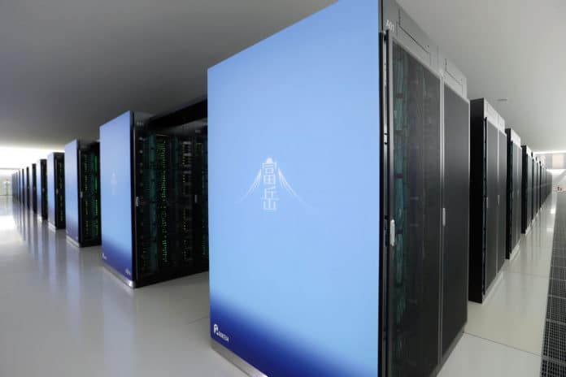

# Examples of top supercomputers

How do the top supercomputers of the world look like in a more detail? Let's
have a brief look on some of the most powerful systems in the world.

## Fugaku, Japan

 

Fugaku is currently (as of June 2020) the most powerful computer in the world,
with the theoretical peak performance of 514 PFlop/s. Fugaku is hosted by
RIKEN Center for Computational Science in Kobe, Japan, and the system is
manufactured by Fujitsu. Fukagu is a bit of an exception in the top-10 as it
uses ARM A64FX processors. Each processor has 48 computational cores running
with a clock frequency of 2.2 GHz. Each node contains a single CPU and
additional asssistant cores (2 in computational nodes and 4 in I/O nodes), and
in total there are 7 299 072 cores in the system. The total amount of memory
is 4 866 048 gigabytes. The declared power consumption is 28 MW.

## Summit, USA

Summit is hosted by Oak Ridge National Laboratory, USA, and it is a prime
example of modern day accelerated supercomputer based on GPUs. Summit has in total 4608
nodes, and each node contains two IBM POWER9 processors and six NVIDIA Volta
V100 GPUs. The theoretical peak performance of the system is 201 PFlop/s. The
total amount of memory is over 10 000 000 gigabytes. The declared power consumption is 10 MW.

## Sunway TaihuLight, China

The Chinish Sunway TaihuLight was world's fastest supercomputer for two years in
2016-2017, and it is still (in June 2020) number four in the list with a
theoretical peak performance of 125 PFlop/s. The system uses Chinese designed
multicore processors, where individual CPU cores are not very fast, running
only at 1.45 GHz, but each CPU contains 256 cores. In total there are over 10
000 000 cores in the system and over 1 000 000 gigabytes of memory. The system
runs its own Linux-based operating system, and the programming environment is
also heavily customized in order to support the Sunway CPU architecture. 
The declared power consumption is 15 MW.
